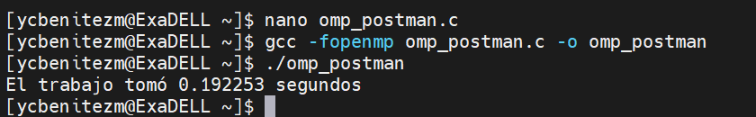

# Postman Sort

El algoritmo de clasificación Postman es una técnica de optimización utilizada en problemas de ruteo o asignación de tareas, inspirada en la tarea real de los carteros que buscan minimizar la distancia total recorrida durante la entrega del correo. Aunque su nombre hace referencia a los carteros,este algoritmo tiene aplicaciones más amplias en áreas como logística, transporte y redes de comunicación.

## Instrucciones de compilación y ejecución
Para compilar y ejecutar el código en el clúster de GuaneExa, siga las siguientes instrucciones:

```shell
ssh guaneExa
```
compile y ejecute el código usando los siguientes comandos:
```shell
srun -n 10 -w ExaDELL --pty /bin/bash
gcc -fopenmp postmansort.c -o postmansort
./postmansort
```
## Comparaciones de tiempos de ejecución:

Secuencial:


Paralelo:



## Conclusión
La implementación paralela del algoritmo de Postman utilizando OpenMP ha demostrado ser altamente efectiva en la reducción del tiempo de ejecución, lo que sugiere que la paralelización es una estrategia eficaz para mejorar el rendimiento de algoritmos de ordenamiento y otros algoritmos computacionales intensivos.
