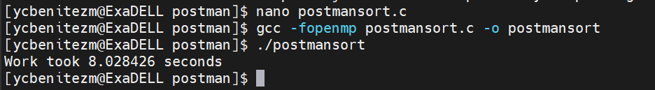
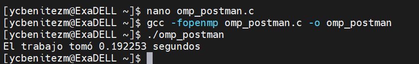
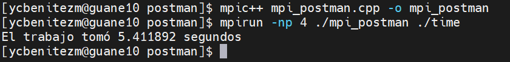

# Integrantes:

Yonathan Camilo Benítez Mancipe 2204133

Adel Alvarez 2191932

# Postman Sort:
PostmanSort con MPI distribuye el trabajo de ordenamiento entre múltiples procesos MPI, aprovechando la capacidad de paralelización de MPI para ordenar grandes conjuntos de datos de manera eficiente en sistemas distribuidos.

Para ejecutar el codigo en mi maquina local hago uso de gcc y utilizo los siguientes comandos comando: 

Para C normal:
  gcc postmansort.c -o postmansort y despues se usa el comando ./postmansort

Para openMP: 
  gcc -fopenmp omp_postman.c -o omp_postman  y despues se usa el comando ./omp_postman

Para MPI:
  mpicc mpi_postman.c -o mpi_postman y despues se usa el comando mpirun -n "numeroDeCores" ./mpi_postman

Para ejecutar el codigo en el cluster GUANE hago uso de la reserva interactiva usando el comando: srun -n4 --pty /bin/bash ,y despues compilo con: 

Para C normal:
  gcc postmansort.c -o postmansort -lm y despues se ejecuta el ejecutable con el comando ./postmansort

Para OpenMP:
  gcc -fopenmp omp_postman.c -o omp_postman -lm y despues se ejecuta el ejecutable con el comando ./omp_postman

Para MPI:
  mpicc mpi_postman.c -o mpi_postman y despues se ejecuta el ejecutable con el comando mpirun -np "numeroDeCores" mpi_postman

## Comparaciones de tiempos de ejecución:

postmansort:

postmansort OMP:

postmansort MPI:

## Conclusión

La implementación MPI de PostmanSort puede no ser la opción más adecuada para problemas de ordenamiento en sistemas con recursos compartidos, donde las implementaciones secuenciales y paralelas con OpenMP ofrecen un mejor rendimiento. Sin embargo, en entornos distribuidos a gran escala, MPI sigue siendo una herramienta poderosa para la paralelización de tareas.

# Binary Search:

